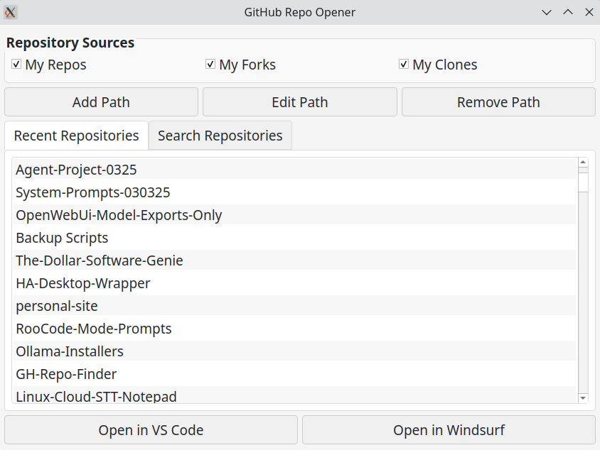
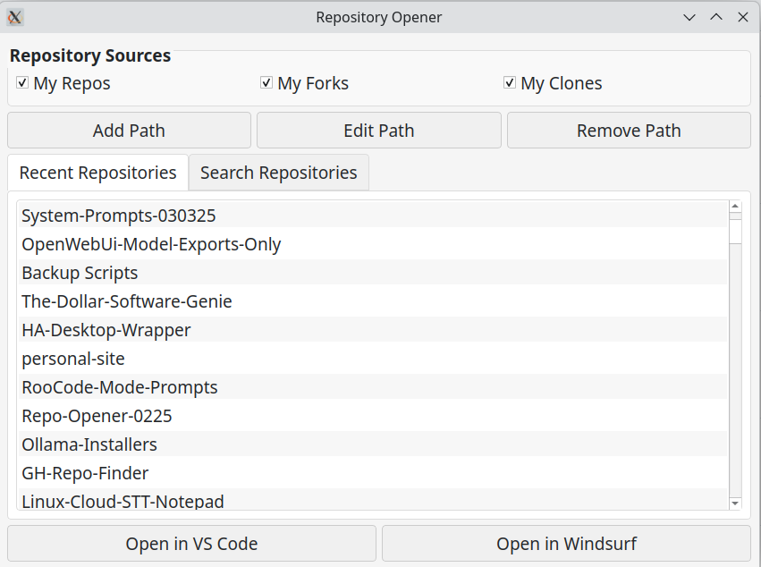
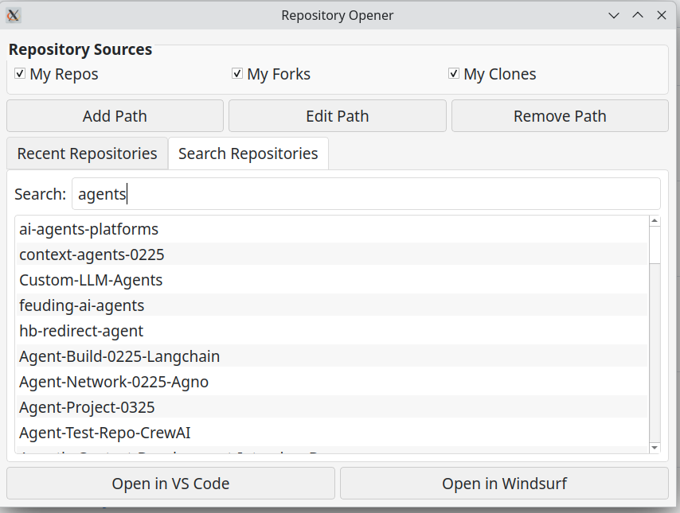
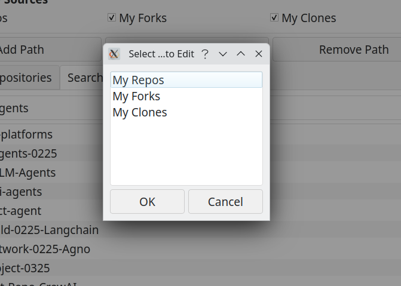
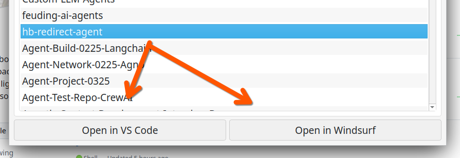

# GitHub Repo Quick Launch Utility

[](https://www.linux.org/)
[](https://www.python.org/)
[](https://github.com/)
[](https://codeium.com/)



A PyQt-based GUI application for Linux that helps you browse, search, and open your Git repositories in different IDEs.

## Features

- Browse repositories from multiple directories:
  - My Repos: `/home/daniel/Development/git-repositories/My-Repos`
  - My Forks: `/home/daniel/Development/git-repositories/My-Forks`
  - My Clones: `/home/daniel/Development/git-repositories/Cloned-Repos`
- Manage repository paths:
  - Add, edit, and remove custom repository paths
  - Settings are saved in `~/.config/repo-opener-0225/settings.json`
- Instant keyword searching with fuzzy matching for quick repository finding
- Open repositories in different IDEs:
  - VS Code
  - Windsurf
  - Additional IDE options can be added in future versions

## Screenshots


*Main application window showing repository list and search functionality*


*Selecting and opening a repository in your preferred IDE*


*Adding a new repository path to track*


*Repository paths are saved in your configuration file*

## Purpose

GitHub Repo Opener is designed to provide quick access to your Git repositories and open them in your preferred IDE. The main goal is to streamline your development workflow by:

- Providing a centralized place to find all your repositories (personal projects, forks, and cloned repositories)
- Enabling fast searching with fuzzy matching to quickly locate the repository you need
- Opening repositories directly in your preferred IDE with a single click
- Managing multiple repository paths through an intuitive interface

This tool is especially useful for developers who work with many different repositories and want to avoid navigating through the file system each time they need to switch projects.

## Requirements

- Python 3.6+
- PyQt5 or PyQt6
- fuzzywuzzy (for fuzzy matching)

## Usage

1. Run the application:
   ```
   ./repo_opener.py
   ```

2. Use the application:
   - First view: Shows repositories in reverse chronological order
   - Second view: Allows you to search through repositories
   - Configure up to three paths for your repositories (My Repos, My Forks, My Clones)
   - Edit paths if you change your repository locations
   - Use the "Open in VS Code" or "Open in Windsurf" buttons to open your selected repository

## Customization

You can modify the default repository paths in the `repo_opener.py` file by changing the `DEFAULT_REPO_PATHS` dictionary.